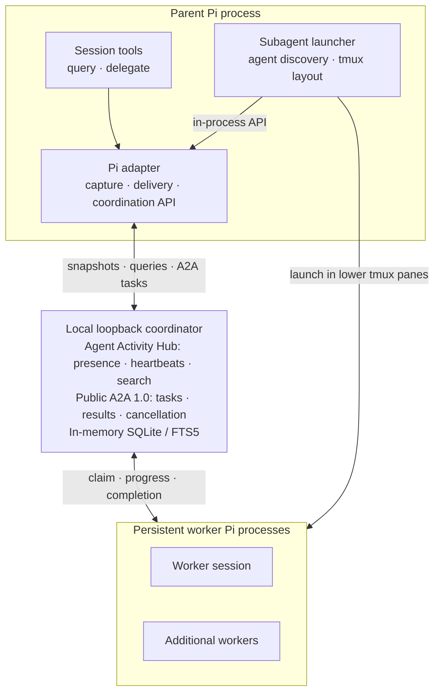

# Agent Base

A local [Pi](https://pi.dev) package that tracks active sessions, coordinates local A2A tasks, and launches persistent specialized agents in visible tmux panes.

## Requirements

- Node.js 22.19 or newer (the hub uses Node's built-in SQLite support)
- Pi 0.82 or newer
- access to the private `Marcusk19/agent-base` GitHub repository and working HTTPS or SSH Git credentials
- tmux for the persistent `subagent` tool; Pi must be running inside tmux when invoking it

Outside tmux, `query_active_sessions` and `delegate_task` continue to work. The `subagent` tool fails explicitly because it cannot create a visible worker pane.

## Install from private GitHub

Verify that the Git client can read the private repository before installing. GitHub CLI authentication does not necessarily configure credentials for every Git client.

```bash
git ls-remote https://github.com/Marcusk19/agent-base.git HEAD
# or
git ls-remote git@github.com:Marcusk19/agent-base.git HEAD
```

Authorized users should install a deterministic release tag:

```bash
pi install git:github.com/Marcusk19/agent-base@v0.1.0
```

SSH users can install from the private repository with:

```bash
pi install git:git@github.com:Marcusk19/agent-base
```

The Git package contains committed release bundles and bundled agent definitions. Installation requires no repository clone, package-manager command, build, daemon service, or agent symlink. It does not start the daemon; the first Pi session starts it lazily.

A pinned tag does not advance during `pi update --extensions`. Move to a newer release by reinstalling that tag:

```bash
pi install git:github.com/Marcusk19/agent-base@v0.2.0
```

Users who intentionally track the default branch can install and update it with:

```bash
pi install git:github.com/Marcusk19/agent-base
pi update --extensions
```

### Migrate from local packages

Remove old registrations before installing so Pi does not register duplicate tools:

```bash
pi remove /absolute/path/to/agent-base
pi remove /absolute/path/to/mkok-subagents
pi install git:github.com/Marcusk19/agent-base@v0.1.0
pi list
```

`pi list` should contain exactly one agent-base package. The source checkouts themselves do not need to be deleted.

Remove the Git package with:

```bash
pi remove git:github.com/Marcusk19/agent-base@v0.1.0
```

## Development

Use pnpm for source work:

```bash
pnpm install --frozen-lockfile
pnpm run check
pnpm run build:release
pnpm run test:git-artifact
```

## Architecture



The hub discovers live Pi sessions and resolves explicit targets; A2A carries task operations through the same loopback coordinator. The subagent launcher owns worker process and pane lifecycle without receiving hub credentials.

See [`docs/resources/architecture.md`](docs/resources/architecture.md) for the detailed package map, protocols, data flows, state machines, recovery behavior, security invariants, test seams, and extension guide.

## Privacy model

The extension captures only:

- user text;
- visible assistant text and assistant stop/error status;
- tool name, status, and timing;
- session state and basic metadata such as cwd and display name.

It deliberately excludes thinking blocks, images, tool arguments, raw tool output, provider payloads, extension details, and authentication material. Active transcript data lives only in an in-memory SQLite database. Transcript text, excerpts, retry queues, and tool-result spill files are never written to disk. The runtime directory contains only a protected discovery record used to connect to the loopback daemon.

The daemon binds to `127.0.0.1` on a dynamic port and authenticates every endpoint with a random bearer token. Reporters heartbeat every 10 seconds; missing sessions expire after 45 seconds. An empty daemon exits after a 30-second grace period.

The package also includes `scout`, `planner`, `reviewer`, `worker`, and `executor` agents. Agents use `openai/gpt-5-mini` by default to keep delegated work inexpensive. Set `PI_SUBAGENT_MODEL` to choose a global model, or declare `model` in a user/project agent definition for a more specific override. User definitions override bundled definitions, and trusted project definitions override both when project scope is enabled.

## Querying active sessions

The extension registers the read-only `query_active_sessions` tool. It excludes the calling session by default and enforces compact, mode-specific output:

- overview defaults to 10 sessions, one latest-user excerpt per session, 300 characters per excerpt, and a 6,000-character hub budget;
- targeted search defaults to five sessions, two FTS excerpts per session, 800 characters per excerpt, and an 8,000-character hub budget;
- model-facing tool content omits internal session/event IDs, adapter metadata, process IDs, and complete transcript payloads;
- the absolute response ceiling remains 40,000 characters when callers explicitly request larger limits.

Full structured results remain available in tool `details` for local diagnostics without duplicating them in model-facing content.

Example questions:

- "What's going on in my other sessions?"
- "Which session is working on PROJQUAY-123?"
- "Does anything need my attention?"
- "Are two sessions duplicating work?"
- "Which active session has a failed or still-running tool?"

## Pi tools and A2A coordination

The package automatically registers three Pi tools:

- `query_active_sessions` is read-only and returns bounded evidence about other active sessions, including a `deliveryTargetId` when a session can receive delegated work.
- `delegate_task` sends text work to exactly one selected `deliveryTargetId`, fetches one bounded task snapshot, or explicitly requests cancellation. It never accepts a caller-supplied coordinator URL.
- `subagent` launches named, persistent Pi workers in tmux and coordinates single, parallel, or chained tasks through the same local A2A runtime. The parent stays in the top pane while worker panes share the lower region.

The daemon publishes a public A2A 1.0 HTTP+JSON Agent Card on loopback. Fetching
`/.well-known/agent-card.json` does not send or require an Authorization header;
SendMessage, GetTask, ListTasks, CancelTask, and private delivery operations use
the source or target session's ephemeral bearer capability. Tasks and results
are ephemeral and disappear with their source session or a daemon restart.

The required `urn:agent-activity-hub:extension:local-coordination:v1`
extension selects either an explicitly named delivery-capable session or an
installed managed-worker provider. The coordinator never chooses a target
implicitly.

### Outbound Pi behavior

`delegate_task` submits work and returns immediately with a task ID. A source Pi
can use `watch` to retrieve the current state and visible target response, or
`cancel` to request cancellation. Watching is a single bounded request, not a
background poll, and aborting a tool call does not cancel the remote task.

### Inbound Pi behavior

A Pi session with prompt injection support advertises task delivery and claims
work only while locally idle. The adapter injects the bounded task as an
attributed `[A2A delegated task]` user prompt. Visible assistant text is returned
to the source; thinking, tool arguments, raw tool output, and the synthetic
inbound turn are excluded from hub capture and task results. Turn errors,
empty visible results, cancellation, and delivery failures become explicit task
states. No additional model is launched by the coordination layer—the receiving
Pi handles the prompt with its configured model and tools.

### Extension-layer orchestration

Trusted Pi extensions can request a versioned, in-process coordination API on
`agent-activity-hub:coordination-api:v1`. The API can wait for a newly launched Pi by
its exact harness session ID and then send, watch, or cancel through the current
source reporter. It exposes methods rather than daemon URLs, root tokens, or
per-session capabilities, and resolves credentials again for every operation.
This seam lets `packages/subagents` own tmux/process UI while
`packages/pi-extension` continues to own discovery and A2A semantics.

Managed-worker providers and non-Pi adapters remain available as deeper daemon
extension points when launch must be initiated by the coordinator itself.

## Monitor API

The hub daemon exposes a read-only monitor API for standalone activity inspection:

```text
GET /monitor/v1/snapshot                         Current bounded snapshot
GET /monitor/v1/snapshot?after=<rev>&wait=<ms>   Long-poll for changes
GET /monitor/v1/sessions/<monitor-id>             Bounded session detail
```

Monitor endpoints use a separate 64-hex-character capability published in `monitor.json`. This capability cannot access session mutation, transcript search, task operations, or daemon maintenance. Monitor responses exclude verbatim messages, thinking, tool arguments/output, task prompt/result text, process IDs, harness-private IDs, and capabilities.

Adapters may publish bounded `activity.summary` events for human-readable status. When no summary exists, the daemon uses deterministic operational text such as "assistant responding" or "idle."

## Activity Monitor

The standalone Go monitor is harness-agnostic and read-only:

```bash
agent-hub               # open the Charmbracelet live monitor
agent-hub list          # print one live snapshot and exit
agent-hub list --json   # emit the monitor v1 snapshot contract
agent-hub version
```

The TUI uses Bubble Tea, Bubbles, and Lip Gloss. It supports filtering (`/`), sorting (`s`), manual rediscovery (`r`), responsive list/detail layouts, and visibly stale data during reconnects. It reads the protected `monitor.json` record but never starts the daemon or stores activity locally.

Checksummed macOS and Linux binaries are attached to tagged GitHub Releases. The Agent Base Pi package continues to install the TypeScript adapters and daemon; it does not install the standalone monitor.

## A2A privacy and limits

Only TextPart and bounded structured DataPart content are accepted. File/media
parts, remote transport, persistence, streaming, push notifications, and
extended Agent Cards are not supported. Task content, capabilities, and queues
remain in the daemon's in-memory SQLite database and are never written to the
runtime directory.

## Migrating from the active session registry

Close active Pi/adapter sessions, wait for the legacy daemon to exit, update Agent Base, and restart sessions. Agent Activity Hub does not migrate ephemeral sessions or tasks.

If a legacy daemon is still running when the renamed hub starts, it will refuse with `LEGACY_DAEMON_RUNNING`. Kill the legacy daemon process or wait for its empty exit timeout, then retry.

Environment variables have been renamed:
- `AGENT_SESSION_TOKEN` → `AGENT_HUB_TOKEN`
- `AGENT_SESSION_DISCOVERY_FILE` → `AGENT_HUB_DISCOVERY_FILE`
- `AGENT_SESSION_EMPTY_EXIT_MS` → `AGENT_HUB_EMPTY_EXIT_MS`
- `AGENT_SESSION_LEASE_MS` → `AGENT_HUB_LEASE_MS`

The runtime directory has moved from `agent-session-registry` to `agent-activity-hub`, and the discovery file from `registry.json` to `hub.json`.

## Troubleshooting

### Hub disconnected

Capture and prompts continue when the daemon is unavailable. The reporter retries with bounded backoff, re-discovers or restarts the daemon, and restores the current branch snapshot. If it remains disconnected, verify Node.js is at least 22.19 and reinstall or update the Git package.

### Coordinator restarted

A daemon restart intentionally invalidates active A2A task IDs. Callers receive
a task-not-found response with `coordinator_restarted` metadata and must resubmit.

### Incompatible protocol

The installed extension and an already-running daemon are from different protocol versions. Close active Pi sessions, wait 30 seconds for the empty daemon to exit (or terminate its PID from the protected discovery record), update/rebuild the package, and reload Pi.

## Manual acceptance

1. Install the package and open two Pi sessions in different terminals.
2. Give each session a distinct task, then ask the first: "What's going on in my other sessions?" Confirm exactly one `query_active_sessions` call reports the second session.
3. Ask a topic-specific question and confirm the answer includes bounded transcript evidence from the other session.
4. Run a failing tool in the second session and confirm it appears as deterministic attention evidence.
5. Close the second Pi and confirm it disappears immediately from the first session's next query.
6. Start it again, kill that Pi process, and confirm it disappears within 45 seconds.
7. Kill the hub daemon, continue activity in the surviving Pi, and confirm the daemon is recreated and the current branch is restored.
8. Inspect the runtime directory (`$XDG_RUNTIME_DIR/agent-activity-hub`, or the platform temp fallback) and confirm it contains no transcript, thinking, tool arguments/output, or log files.
